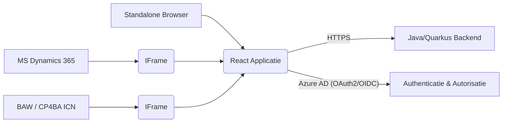

# Handboek: React Embeddable Applicatie voor MSD365, Standalone en BAW/CP4BA ICN Gebruik

**Doel:** Dit handboek beschrijft de architectuur en implementatierichtlijnen voor het ontwikkelen van een React-applicatie die naadloos kan worden geïntegreerd in Microsoft Dynamics 365, IBM Business Automation Workflow (BAW) / Cloud Pak for Business Automation (CP4BA) ICN, en ook als een zelfstandige webapplicatie via een URL toegankelijk is.

**Technologie Stack:**

  * **Frontend:** React (JavaScript/TypeScript)
  * **Backend:** Java (Quarkus), gehost op OpenShift
  * **Authenticatie:** Microsoft Azure AD (OAuth2/OpenID Connect)
  * **Frontend Authenticatie Bibliotheek:** MSAL.js (Microsoft Authentication Library)

### 1\. Architectuur Overzicht

De applicatie is ontworpen als een frontend-applicatie (React) die communiceert met een beveiligde backend API (Java/Quarkus). Authenticatie en autorisatie worden afgehandeld via Azure AD. De integratie met MSD365 en ICN vereist specifieke overwegingen voor contextoverdracht en authenticatie binnen de iframe-omgeving.



### 2\. Frontend (React) Implementatie

#### 2.1. Authenticatie met MSAL.js

De frontend applicatie gebruikt MSAL.js voor de authenticatie flow met Azure AD.

  * **Installatie:**

    ```bash
    npm install @azure/msal-browser @azure/msal-react
    # Of met Yarn
    yarn add @azure/msal-browser @azure/msal-react
    ```

  * **Configuratie ( `msalConfig.js` ):**

    ```javascript
    import { PublicClientApplication } from "@azure/msal-browser";

    export const msalConfig = {
        auth: {
            clientId: "YOUR_CLIENT_ID", // Vervang door de Application (client) ID van je Azure AD app-registratie
            authority: "[https://login.microsoftonline.com/YOUR_TENANT_ID](https://login.microsoftonline.com/YOUR_TENANT_ID)", // Vervang door je Azure AD Tenant ID of domeinnaam
            redirectUri: window.location.origin, // Zorg ervoor dat dit is geregistreerd in je Azure AD app-registratie
            postLogoutRedirectUri: window.location.origin,
        },
        cache: {
            cacheLocation: "localStorage", // Of sessionStorage
            storeAuthStateInCookie: false, // Set to true for IE 11
        }
    };

    export const msalInstance = new PublicClientApplication(msalConfig);
    ```

    **Referenties:**

      * [Microsoft Authentication Library for JavaScript (MSAL.js)](https://github.com/AzureAD/microsoft-authentication-library-for-js)
      * [Quickstart: Acquire a token and call the Microsoft Graph API from a JavaScript single-page app using the implicit grant flow](https://www.google.com/search?q=https://learn.microsoft.com/en-us/azure/active-directory/develop/quickstart-v2-javascript-auth-code)

  * **Authenticatie Flow:**

      * **Standalone Modus:** De applicatie initieert de authenticatie flow direct via MSAL.js (`loginRedirect` of `loginPopup`). Na succesvolle authenticatie ontvangt de applicatie een ID-token en een access token.
      * **Embedded in MSD365 (IFrame):**
          * **Stille Authenticatie (`acquireTokenSilent`):** Probeer eerst een token stil te verkrijgen op basis van een bestaande sessie.
          * **Token Ontvangen via `postMessage`:** Als stille authenticatie mislukt (bijvoorbeeld geen bestaande sessie in de iframe), luistert de embedded applicatie naar een `postMessage` van het parent window (MSD365) dat het access token bevat.
      * **Embedded in BAW / CP4BA ICN (IFrame):**
          * **Token Doorsturen via `postMessage`:** De ICN applicatie stuurt het access token (verkregen via ICN authenticatie) via `postMessage` naar de embedded React applicatie.
          * **Stille Authenticatie (`acquireTokenSilent`):** Indien mogelijk en geconfigureerd, kan een poging tot stille authenticatie worden overwogen.

  * **Implementatie Voorbeeld (React Component):**

    ```typescript jsx
    import React, { useEffect, useState, createContext, useContext } from 'react';
    import { useMsal, useAccount, useIsAuthenticated } from "@azure/msal-react";
    import { InteractionRequiredAuthError } from '@azure/msal-browser';

    const AccessTokenContext = createContext<string | null>(null);
    export const useAccessToken = () => useContext(AccessTokenContext);

    const AuthGuard: React.FC<{ children: React.ReactNode }> = ({ children }) => {
        const { instance, accounts, inProgress } = useMsal();
        const isAuthenticated = useIsAuthenticated();
        const account = useAccount(accounts[0] || {});
        const [accessToken, setAccessToken] = useState<string | null>(null);

        useEffect(() => {
            if (isAuthenticated && account) {
                const request = {
                    scopes: ["YOUR_API_SCOPE"], // Vervang door de scopes die je backend API nodig heeft
                    account: account,
                };

                instance.acquireTokenSilent(request)
                    .then((response) => {
                        setAccessToken(response.accessToken);
                    })
                    .catch(async (error) => {
                        if (error instanceof InteractionRequiredAuthError) {
                            // Fallback naar interactieve login indien nodig (minder wenselijk in embedded scenario)
                            instance.loginRedirect(request).catch(loginError => console.error(loginError));
                        } else {
                            console.error("Silent token acquisition error:", error);
                        }
                    });
            }
        }, [isAuthenticated, account, instance]);

        useEffect(() => {
            const handleMessage = (event: MessageEvent) => {
                if (event.data && event.data.accessToken) {
                    setAccessToken(event.data.accessToken);
                }
            };

            window.addEventListener('message', handleMessage);

            return () => {
                window.removeEventListener('message', handleMessage);
            };
        }, []);

        if (inProgress === "login" || inProgress === "acquireToken") {
            return <div>Bezig met authenticatie...</div>;
        }

        return accessToken ? (
            <AccessTokenContext.Provider value={accessToken}>
                {children}
            </AccessTokenContext.Provider>
        ) : (
            <div>Niet geauthenticeerd.</div>
        );
    };

    export default AuthGuard;
    ```

#### 2.2. Tokenoverdracht naar Backend

Het access token moet in de `Authorization` header van elk API-verzoek naar de backend worden meegestuurd.

```javascript
import { useAccessToken } from './AuthGuard';

const fetchData = async () => {
    const accessToken = useAccessToken();
    if (accessToken) {
        try {
            const response = await fetch('/api/data', {
                headers: {
                    'Authorization': `Bearer ${accessToken}`,
                },
            });
            const data = await response.json();
            console.log(data);
        } catch (error) {
            console.error("Fout bij het ophalen van data:", error);
        }
    } else {
        console.warn("Geen access token beschikbaar.");
    }
};
```

#### 2.3. Context Overdracht vanuit Host

De embedded applicatie moet contextuele informatie van de host (MSD365 of ICN) kunnen ontvangen.

  * **Querystring:** Lees parameters uit de URL wanneer de iframe wordt geladen. (Zowel voor MSD365 als ICN)

    ```javascript
    import { useEffect, useState } from 'react';
    import { useSearchParams } from 'react-router-dom';

    const ContextFromQuery = () => {
        const [searchParams] = useSearchParams();
        const klantId = searchParams.get('klant');
        const documentId = searchParams.get('documentId');
        const caseId = searchParams.get('caseId');

        useEffect(() => {
            if (klantId) console.log("Klant ID vanuit querystring:", klantId);
            if (documentId) console.log("Document ID vanuit querystring:", documentId);
            if (caseId) console.log("Case ID vanuit querystring:", caseId);
            // Gebruik de contextuele informatie
        }, [klantId, documentId, caseId]);

        return <></>;
    };
    ```

  * **Iframe API (`window.postMessage`):** Luister naar berichten die vanuit het parent window (MSD365 of ICN) worden gepost.

    ```javascript
    import { useEffect, useState } from 'react';

    const ContextFromPostMessage = () => {
        const [hostContext, setHostContext] = useState<any>(null);

        useEffect(() => {
            const handleMessage = (event: MessageEvent) => {
                // Controleer de origin van het bericht voor de veiligheid
                // if (event.origin === 'YOUR_DYNAMICS_URL' || event.origin === 'YOUR_ICN_URL') {
                if (event.data && event.data.context) {
                    setHostContext(event.data.context);
                    console.log("Context via postMessage:", event.data.context);
                    // Gebruik de context
                }
                // }
            };

            window.addEventListener('message', handleMessage);

            return () => {
                window.removeEventListener('message', handleMessage);
            };
        }, []);

        return <></>;
    };
    ```

  * **Dynamics 365 Client API (`Xrm.Page`):** Alleen relevant wanneer ingebed in MSD365.

    ```javascript
    useEffect(() => {
        if (typeof window !== 'undefined' && window.Xrm && window.Xrm.Page && window.Xrm.Page.data && window.Xrm.Page.data.entity) {
            const entityId = window.Xrm.Page.data.entity.getId();
            if (entityId) {
                console.log("Entity ID vanuit Dynamics API:", entityId);
                // Gebruik de entityId
            }
        } else {
            console.log("Dynamics 365 context niet beschikbaar.");
        }
    }, []);
    ```

  * **ICN JavaScript API (Beperkt gebruik vanuit Cross-Origin Iframe):** Communicatie via `postMessage` met een ICN plugin is de meest waarschijnlijke aanpak.

#### 2.4. Gebruiksvriendelijke en Toegankelijke UI

  * **Component-gebaseerde architectuur:** React's component model bevordert herbruikbaarheid en onderhoudbaarheid.
  * **Responsief ontwerp:** Zorg ervoor dat de UI goed werkt op verschillende schermformaten.
  * **Toegankelijkheid (WCAG):** Houd rekening met toegankelijkheid tijdens de ontwikkeling.
      * **Referentie:** [Web Content Accessibility Guidelines (WCAG)](https://www.w3.org/WAI/standards-guidelines/wcag/)

#### 2.5. Conditional Rendering voor Embedded/Standalone Modus

Gebruik omgevingsvariabelen of controleer de aanwezigheid van specifieke contextuele data om te bepalen in welke omgeving de applicatie draait.

```javascript
import { useEffect, useState } from 'react';
import { useSearchParams } from 'react-router-dom';

const EnvironmentDetector = () => {
    const [searchParams] = useSearchParams();
    const isEmbeddedInMSD365 = typeof window !== 'undefined' && typeof window.Xrm !== 'undefined';
    const isEmbeddedInICN = searchParams.has('documentId') || searchParams.has('caseId'); // Voorbeeld

    useEffect(() => {
        if (isEmbeddedInMSD365) {
            console.log("Applicatie draait embedded in Dynamics 365.");
            // Specifieke MSD365 logica
        } else if (isEmbeddedInICN) {
            console.log("Applicatie draait embedded in IBM Content Navigator.");
            // Specifieke ICN logica
        } else {
            console.log("Applicatie draait standalone.");
            // Standaard standalone logica
        }
    }, [isEmbeddedInMSD365, isEmbeddedInICN, searchParams]);

    return <></>;
};
```

### 3\. Backend (Java/Quarkus) Implementatie

#### 3.1. API Ontwikkeling

Ontwikkel de backend API met Java en het Quarkus framework.

#### 3.2. Beveiliging met Azure AD

De backend API moet beveiligd worden om alleen geauthenticeerde verzoeken met een geldig access token te accepteren.

  * **Token Validatie:** Implementeer een mechanisme om het Bearer-token te valideren tegen Azure AD.

  * **Quarkus Security Extensions:** Gebruik de security extensies van Quarkus.

      * **Referentie:** [Quarkus Security](https://quarkus.io/guides/security)
      * **Referentie:** [Quarkus Security - OIDC](https://quarkus.io/guides/security-openid-connect)

  * **Voorbeeld Quarkus Security Configuratie (`application.properties`):**

    ```properties
    quarkus.oidc.enabled=true
    quarkus.oidc.client-id=YOUR_BACKEND_CLIENT_ID // Optioneel
    quarkus.oidc.auth-server-url=[https://login.microsoftonline.com/YOUR_TENANT_ID/v2.0](https://login.microsoftonline.com/YOUR_TENANT_ID/v2.0)
    quarkus.oidc.token.jwt.issuer=[https://sts.windows.net/YOUR_TENANT_ID/](https://sts.windows.net/YOUR_TENANT_ID/)
    quarkus.oidc.token.jwt.audience=YOUR_API_APPLICATION_ID
    ```

#### 3.3. Context Gebruik in Backend

De backend kan de contextuele informatie gebruiken die vanuit de frontend wordt meegestuurd.

### 4\. Single Sign-On (SSO) met Azure AD

SSO wordt gefaciliteerd door Azure AD en MSAL.js. Zorg voor de juiste app-registraties en toestemmingen.

### 5\. Deployment op OpenShift

  * **Containerisatie:** Package frontend en backend als Docker containers.
  * **OpenShift Resources:** Definieer de benodigde OpenShift resources.
  * **Omgevingsvariabelen:** Gebruik ConfigMaps en Secrets.

### 6\. Toekomstige Uitbreidbaarheid naar Meerdere Platformen

  * **Abstractie:** Ontwerp de frontend platform-agnostisch.
  * **Adapter Patroon:** Overweeg adapters voor platform-specifieke functionaliteiten.
  * **Configuratie:** Gebruik configuratie voor platform-specifieke instellingen.

### 7\. Belangrijke Overwegingen

  * **Beveiliging:** Wees voorzichtig met `postMessage` en behandel tokens veilig.
  * **Performance:** Optimaliseer de laadtijd.
  * **Foutafhandeling:** Implementeer robuuste foutafhandeling.
  * **Logging en Monitoring:** Zet logging en monitoring op.

### 8\. Frontend (React) Integratie in ICN

#### 8.1. Context Overdracht vanuit ICN

  * **Aangepaste Parameters in Iframe URL:** Lees parameters uit de URL.
  * **ICN JavaScript API:** Beperkt gebruik vanuit cross-origin iframe.
  * **`postMessage` vanuit ICN:** Luister naar berichten van het parent window.

#### 8.2. Authenticatie in ICN Context

  * **Token Doorsturen via `postMessage` vanuit ICN:** De meest waarschijnlijke aanpak.
  * **Stille Authenticatie met MSAL.js:** Complexer, vereist zorgvuldige configuratie.
  * **Backend-for-Frontend (BFF) Patroon:** Geavanceerde aanpak om tokenuitwisseling te centraliseren.

#### 8.3. ICN JavaScript API (Beperkt gebruik vanuit Cross-Origin Iframe)

Communicatie via `postMessage` met een ICN plugin.

### 9\. Conditional Functionaliteit voor ICN Integratie

Detecteer de ICN omgeving op basis van URL parameters of andere indicatoren.

```javascript
import { useEffect, useState } from 'react';
import { useSearchParams } from 'react-router-dom';

const ICNIntegrationDetector = () => {
    const [searchParams] = useSearchParams();
    const isInICN = searchParams.has('icnContext') || searchParams.has('documentId') || searchParams.has('caseId'); // Voorbeeld parameters

    useEffect(() => {
        if (isInICN) {
            console.log("Applicatie
